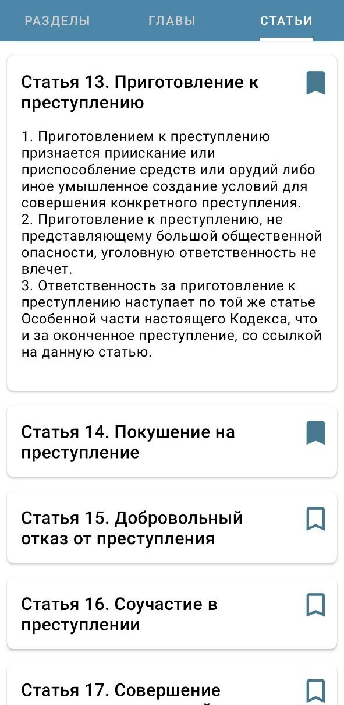
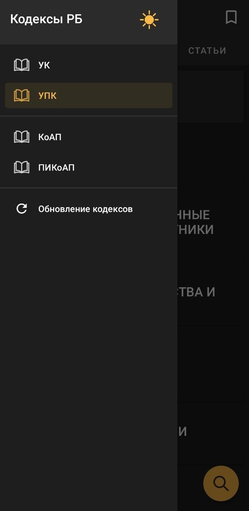
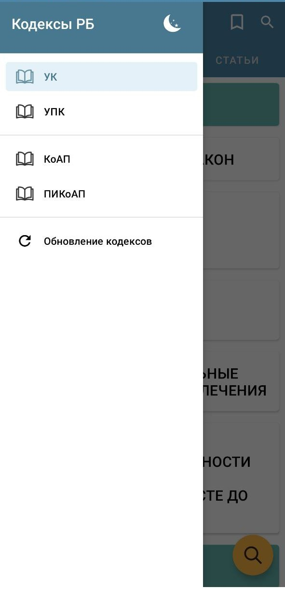

# Законы РБ

**Законы РБ** - это простое и удобное приложение для просмотра кодексов Республики Беларусь.

Основные функции:

- Поиск по заголовкам разделов, глав, статей и их содержимому
- Возможность добавления статей в избранное
- Удобная навигация: при нажатии на главу откроются статьи этой главы
- Темная тема :)

На данный момент в приложении присутствуют четыре кодекса:

- *Уголовный Кодекс*
- *Уголовно-Процессуальный Кодекс*
- *Кодекс об Административных Правонарушениях*
- *Процессуально-Исполнительный Кодекс*

Планируется добавление еще нескольких:

- *Гражданский Кодекс*
- *Трудовой Кодекс*
- *Налоговый Кодекс*
- *Банковский Кодекс*

---

  

  

## Разработчики

- [AlexanderSimakov](https://github.com/AlexanderSimakov) ( [LinkedIn](https://www.linkedin.com/in/alexander-simakov-6a3499228/) )
- [tokyolem](https://github.com/tokyolem) ( [LinkedIn](https://www.linkedin.com/in/heenworker/) )

## Лицензионное соглашение
